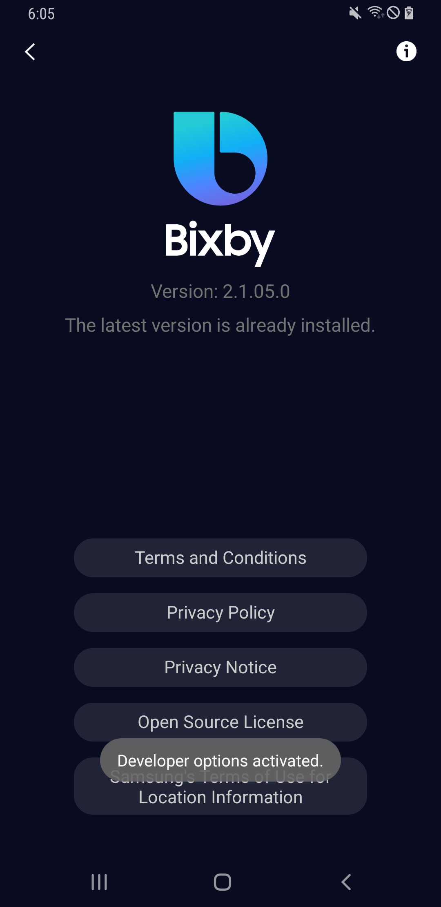

## On-device-testing-ko-kr

1. 빅스비 마켓플레이스를 킨다
2. 빅스비 설정에 들어간다.
3. 스크롤을 맨 아래로 내려서 빅스비 설정을 클릭한다.
4. 아래 화면에 'Version:'부분의 숫자를 빠르게 5번 탭한다.

5. 빠르게 5번 탭한 후 개발자 옵션이 켜졌다는 알람이 확인되면 뒤로 돌아간다.

6. 스크롤을 맨 아래로 내리면 개발자 옵션이 켜진것을 확인 할 수 있다.

7. 개발자 옵션 버튼을 눌러서 랜딩되는 빅스비 스튜디오 홈페이지에서 자신의 빅스비 스튜디오 아이디로 로그인 한다.

8. 로그인 후 다시 개발자 옵션으로 돌아와서 아래 ID를 입력한다.

   > private version의 ID

9. 입력하면 아트위크의 test version이 켜진 상태가 유지되며, 마켓플레이스로 돌아가서 빅스비 버튼을 누른 후 QA가 가능해진다. 

> 해당 문서는 artweek 팀에서 번역하였습니다.
