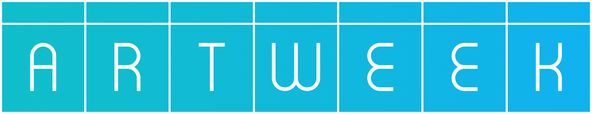
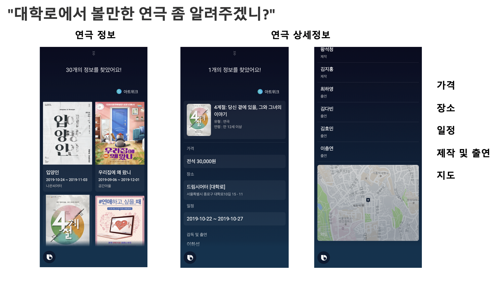
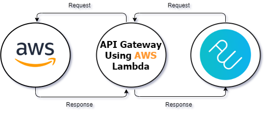
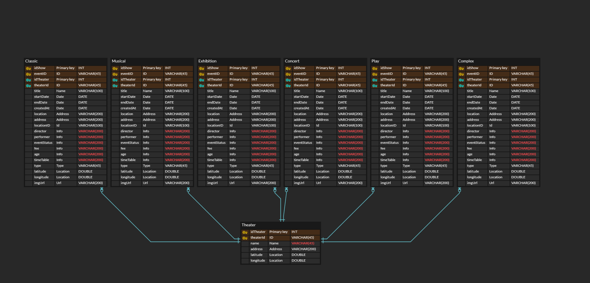
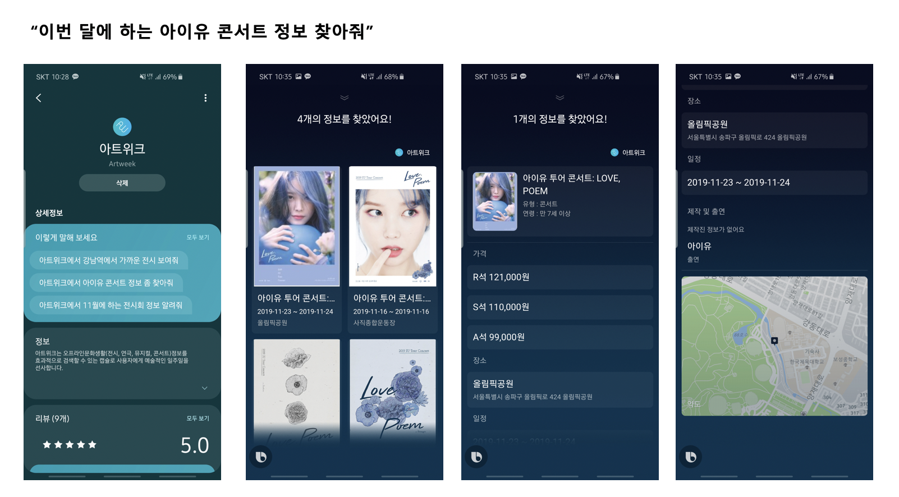
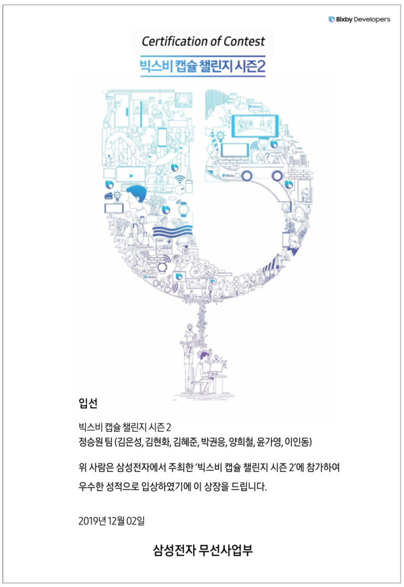
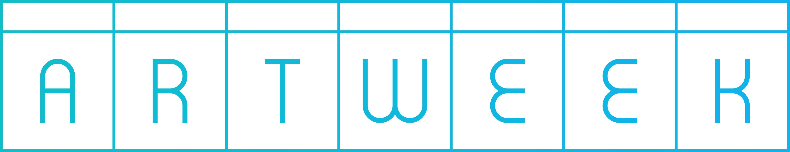

# 아트위크 ARTWEEK 



<p align="center">
"Artweek과 함께하는 예술적인 일주일"
</p>
<p align="center">
  
  
  
</p>


## 목차

1. [아트위크란?](#아트위크란?)

2. [캡슐구조](#캡슐구조)

3. [캡슐설정](#캡슐설정)

4. [사전(Vocabulary)](#사전(Vocabulary))

5. [발화(Training)](#발화(Training))

6. [UI&UX(Layout)](#UI&UX(Layout))

7. [구매페이지](#구매페이지)

8. [Heroku 서버와 Django orm](#Heroku-서버와-Django-orm)

9. [AWS 서버와 외부 DB](#AWS-서버와-외부-DB)

10. [HTTP 요청](#HTTP-요청)

11. [on Marketplace!](#On-Marketplace!)

12. [부록](#부록)

    ​     


## 아트위크란?

Artweek 팀은 사용자가 오프라인 문화생활을 더욱 편리하게 즐길 수 있도록 영감을 제공합니다.

아트위크 캡슐은 오프라인 문화생활 정보를 사용자 대신 찾아줍니다. 이용 중 문의사항이 있으신 경우 e-mail로 연락바랍니다.

<p align="center">makeartweek@gmail.com</p>
## 캡슐구조

### models
> 파일구조
```cmd
├── actions
│   ├── GetCurrentPosition.model.bxb
│   ├── SearchByLocation.model.bxb
│   └── SearchEvent.model.bxb
└── concepts
   ├── Primitive
   │   ├── Event
   │   │   ├── Concert.model.bxb
   │   │   ├── Director.model.bxb
   │   │   ├── EventID.model.bxb
   │   │   ├── EventStatus.model.bxb
   │   │   ├── Exhibition.model.bxb
   │   │   ├── Fee.model.bxb
   │   │   ├── Images.model.bxb
   │   │   ├── ImgUrl.model.bxb
   │   │   ├── Musical.model.bxb
   │   │   ├── Performer.model.bxb
   │   │   ├── Theater.model.bxb
   │   │   ├── TimeTable.model.bxb
   │   │   ├── Title.model.bxb
   │   │   ├── Type.model.bxb
   │   │   └── TypicalAgeRange.model.bxb
   │   ├── Place
   │   │   ├── Address.model.bxb
   │   │   ├── District.model.bxb
   │   │   ├── Location.model.bxb
   │   │   ├── LocationID.model.bxb
   │   │   ├── Near.model.bxb
   │   │   └── Nearby.model.bxb
   │   ├── Signal
   │   │   ├── DirectorPostposition.model.bxb
   │   │   ├── PerformerPostposition.model.bxb
   │   │   └── SearchKeyword.model.bxb
   │   └── Time
   │       ├── CreatedAt.model.bxb
   │       ├── EndDate.model.bxb
   │       ├── Recent.model.bxb
   │       └── StartDate.model.bxb
   └── Structure
       ├── InfoSearchState.model.bxb
       ├── MyPositionList.model.bxb
       ├── Mypos.model.bxb
       ├── NearSearchState.model.bxb
       └── Point.model.bxb
```

모델은 크게 `actions` 와 `concepts` 두 폴더로 구성되어 있습니다.

#### actions

`action`에서는 캡슐이 사용자가 원하는 행동을 수행하기 위해 필요한 동작을 정의합니다. 이를 바탕으로 Business Logic에서 구체적인 작업을 실시하게 됩니다. `actions`폴더는 다음과 같이 구성되어 있습니다.

- `GetCurrentPosition` : 사용자의 현재 위치를 위도, 경도로 표기하여 반환하는 `action`.
- `SearchByLocation` : 사용자가 본인의 위치를 기준으로 한 정보를 요청할 때 이를 찾아주는 `action`.
- `SearchEvent` : 발화를 통해 제공받은 단서를 기반으로 적합한 문화생활 정보를 제공하는 `action`.

#### concepts

`concept`은 인식된 발화 및 결과물을 구성하는 요소가 담길 변수의 특성을 지정합니다. `concepts`폴더는 `Primitive`와 `Structure` 두 폴더로 나누어 구성하였습니다. 

- `Primitive`폴더에는 `Event`, `Place`, `Time`, `signal`등 `concept`의 특성에 따라 세부적인 폴더를 생성해 구분함으로써 효율적으로 모델링을 관리할 수 있도록 했습니다. 

- `Structure`는 여러 개의 `Primitive`가 모인 구조체로, 주로 Business Logic에서 산출된 결과물들이 담기게 되어 사용자에게 보여지게 되는 `concept`을 작성하는 데 사용했습니다.


### resources

> 파일구조


```cmd
├── base
│   ├── capsule.properties
│   ├── endpoints.bxb
│   ├── layouts
│   │   └── macros
│   │       ├── EventOneImage.layout.bxb
│   │       ├── EventSummary.layout.bxb
│   │       ├── LocDetail.layout.bxb
│   │       └── LocEvent.layout.bxb
│   └── views
│       ├── InfoSearchState.view.bxb
│       └── NearSearchState.view.bxb
└── ko-KR
   ├── artweek.hints.bxb
   ├── capsule-info.bxb
   ├── dialogs
   │   ├── NearSearchResult.dialog.bxb
   │   └── Result.dialog.bxb
   └── vocab
       ├── Concert.vocab.bxb
       ├── DirectorPostposition.vocab.bxb
       ├── District.vocab.bxb
       ├── Exhibition.vocab.bxb
       ├── Musical.vocab.bxb
       ├── Nearby.vocab.bxb
       ├── PerformerPostposition.vocab.bxb
       ├── Recent.vocab.bxb
       ├── SearchKeyword.vocab.bxb
       ├── Theater.vocab.bxb
       └── Type.vocab.bxb
```


## 캡슐설정

아트위크 캡슐의 대표발화는 아래와 같이 `hints` 파일에 저장하였습니다. 이를 통해 사용자는 의도에 맞게 대표 발화를 다양화하여 원하는 오프라인 문화생활 정보를 제공받을 수 있습니다. 

```js
hints {
 uncategorized {
   hint (아트위크에서, 강남역에서 가까운 전시 보여줘) {
    preferred-hint (강남역에서 가까운 전시 보여줘)
   }
   hint (아트위크에서, 아이유 콘서트 정보 좀 찾아줘) {
     preferred-hint (아이유 콘서트 정보 좀 찾아줘)
   }
   hint (아트위크에서, 10월에 하는 전시회 정보 알려줘){
     preferred-hint (10월에 하는 전시회 정보 알려줘)
   }
	...
 }
}
```


## 사전(Vocabulary)

아트위크 캡슐이 다양한 패턴의 발화를 인식할 수 있도록 여러 property에 대한 `vocab` 파일을 생성했습니다. 각 `vocab`의 대표어에 대해서 최대한 많은 동의어를 구축함으로써 다양한 발화에 적절한 정보를 제공할 수 있도록 학습시킬 수 있습니다.

이러한 사전의 사용은 다음과 같은  `enum`, `name`, `text` 세 가지 타입을 적절히 사용하여야 하고, 이를 통해 빅스비가 사용자의 의도를 잘 알아들을 수 있습니다.


> [enum](https://bixbydevelopers.com/dev/docs/dev-guide/developers/training.vocabulary#top)

`vocab `중에 `District`의 경우  `enum`을 사용하였는데, 지역은 명칭의 변경 가능성이 적기 때문입니다. 대표어인 지역에 해당하는 유의어와 더불어 `랜드마크` 및 `지하철 역명`을 추가하였습니다. 이를 통해 다양한 발화에 대해 정해진 대표어로 인식하게 함으로써 위치 주소를 명확하게 인식할 수 있게 하였습니다.

```js
vocab (District){

  "강남구" {

    "강남구",
    "강남",
    "강남역",
    "역삼역",
    "코엑스",
  }
   ...
}

```


> [name](https://bixbydevelopers.com/dev/docs/dev-guide/developers/training.vocabulary)

`SearchKeyword`의 경우 `name` 을 사용하였습니다. 사용자에 따라 가장 다양하게 발화가 될 동사라고 생각되어 `검색`이라는 의도를 나타낼 수 있는 비슷한 동사를 추가하였습니다. 여러 다양한 발화에 대한 패턴학습을 통해 이후 `vocab` 에 들어있지 않더라도 자동으로 `SearchKeyword` 로 인식하게 됩니다.

```js
vocab(SearchKeyword) {
  // 보편적인 검색키워드  
  "검색",
  "검색해",
  "검색해줘",
  "검색해라",
  "검색해주세요",
  "검색해줘요",
  "검색좀",
}
```


## 발화(Training)


> **사용자 현재 위치 중심으로 검색하기** 

사용자 질의:
"근처에서 하는 연극 알려줘 ."

정보 제공:
`사용자의 현재 위치` 기준 `반경 5키로` 내에서 열리는 연극 정보 제공


> **특정 장소 중심으로 검색하기**

사용자 질의:
"강남역/강남 근처에서 하는 콘서트 알려줘."

정보 제공:
`강남구` 소재지의 공연장에서 하는 콘서트 정보 제공


> **특정 일정을 중심으로 검색하기**

사용자 질의:
"이번 주/이번 달/오늘 하는 뮤지컬 알려줘."

정보 제공:
`특정 일정`에 상연되는 뮤지컬 정보 제공


> **특정 타입을 중심으로 검색하기**

사용자 질의:
"콘서트/연극/뮤지컬/전시 알려줘."

정보 제공:
`특정 타입`에 해당하는 정보 제공


> **행사 제목을 중심으로 검색하기**

사용자 질의:
"헤드윅 뮤지컬 정보 알려줘."

정보 제공:
`행사 제목`에 해당하는 정보 제공


> **출연진 을 중심으로 검색하기**

사용자 질의:
"양희철이 노래 부르는 콘서트 알려줘."

정보 제공:
`양희철` 이 출연하는 콘서트에 대한 정보 제공


> **제작진 을 중심으로 검색하기**

사용자 질의:
"이인동이 제작한 연극 알려줘."

정보 제공:
`이인동` 이 제작한 연극의 정보 제공


## UI&UX(Layout)

빅스비에 이미 구현된 template를 사용하여 사용자에게 직접적으로 보여지게 될 화면인 view를 제작했습니다. 

Layout은 view와 view에서 사용 가능한 macro로 구성되어 있습니다.


### View

view는 `InfoSearchState` 와 `NearsearchState` 를 사용하였습니다.


### Macro

view의 효율성을 위해서 macro로 `EventOneImage`, `EventSummary`, `LocDetail`, `LocEvent` 를 사용하였습니다.




2개 이상의 정보를 가지고 올 때는 `EventSummary` 가 사용되며, 사용자가 의도를 가지고 상세정보를 원할 때는 `EventOneImage` 가 사용됩니다.

1개의 정보를 가지고 올 때는 `EventOneImage` 로 사용자에게 view를 전달하여 상세정보를 보여주게 됩니다. 


## 구매페이지

사용자 편의를 위하여 `멜론`, `예스24`, `인터파크` 등의 티켓 정보가 있는 경우, 이를 상세페이지에서 확인할 수 있도록 구매페이지 기능을 추가하였습니다.


## Heroku 서버와 Django orm (ver 1.2.6.)

아트위크팀은 AWS 서버에서 Heroku 서버로 이동하며 서버 비용을 해소하였습니다. 또한, `django` orm을 이용하여 DB모델 구축 그리고 REST API 또한 구축하여 언제 어디서든 API실행으로 실시간 DB 갱신이 가능하도록 업데이트 하였습니다.


## AWS 서버와 외부 DB (ver 1.2.5.)

### Flow




### 외부 DB

빅스비 스튜디오에는 내부 DB를 제공하지 않았기 때문에 아트위크 팀은 AWS Server를 통해 외부 DB를 구축하였습니다. 

처음에는 단순히 하나의 오픈 API를 사용하여 Business logic을 구현하고자 했지만 아트위크가 제공하는 서비스는 최대한 많은 오프라인 문화생활(연극, 뮤지컬, 전시, 오페라, 클래식, 콘서트) 정보를 사용자에게 제공하고자 했기 때문에 다양한 오픈 API에서 제공하는 데이터를 보유하고자 했습니다.

그래서 input value에 따라 공연 종류를 구분하여 API를 선택해 정보를 구해오는 비효율적인 방법보다 원하는 모든 공연 정보를 미리 외부 DB에 저장하여 통합적으로 관리해야 할 필요성을 느꼈습니다.


### AWS server

AWS RDS,  Mysql을 사용하여 외부 DB 관리의 효율성을 높였고,

AWS에서 제공하는 API Gateway와 Lambda 함수를 이용하여 DB에서 정보를 제공할 수 있는 **아트위크만의 API**를 제작하였습니다.


### DB 최적화




아트위크의 DB는 상기 사진과 같이 1:N의 관계로 구성되어 있습니다. 즉, 6개의 Event type과 이를 연결하는 1개의 Main location이 존재합니다.

공연 종류에 따라서 Table을 나누어서 원하는 종류의 공연이 아닌 타 종류의 공연은 검색대상에서 제외함으로써 검색속도가 향상되었습니다.


## HTTP 요청

외부 DB에서 빅스비 스튜디오로 데이터를 불러오기 위해서는 아트위크의 API에 http 요청을 실행해야 합니다. 이를 위해서 빅스비에서 사용할 수 있는 `JavaScript API Reference` 중 `config`와 `http`를 활용합니다.

`config`는 capsule.properties나 Config & Secrets와 같은 캡슐의 configuration에 접근하도록 허용합니다.

```javascript
## capsule.properties

config.default.remote.url=#기본 URL
```

다음과 같이 capsule.properties의 config.default.remote.url 변수에 기본 url을 저장해놓습니다. js코드 작성 시 `config.get()` 함수의 인자에 "remote.url"을 할당함으로써 이를 호출할 수 있게 됩니다.


다음으로, http 요청을 위해 사용자에게 제공받은 검색 정보를 remote.url에 추가해야 합니다.

```javascript
  let options = {
    query: {
      title: title,
      performer: performer,
      ... ,
      location: location,
    },
    format: "json"
  };

  console.log(options)
  var db = http.getUrl(config.get("remote.url"), options);
```

이처럼 Business Logic에서 정제된 데이터를 object 타입의 쿼리로 구성합니다. 이를 `http`의 `getUrl()` 함수를 사용해  API에서 json 포맷의 데이터를 get 요청으로 호출하였습니다.


## :star: On Marketplace!

빅스비 마켓플레이스에서 `아트위크`를 만나보실 수 있습니다!





## 부록

- 개발자 환경에서 테스트하는 방법

   [On-device-testing-ko-kr](#https://github.com/makeartweek/bixby/blob/master/On-device-testing-ko-kr.md)
   
- 개인정보처리방침

   [privacy-policy](#https://github.com/makeartweek/bixby/tree/master/Privacy-policy)

- 삼성전자 무선사업부






"from `Artweek` import `inspiration`"
